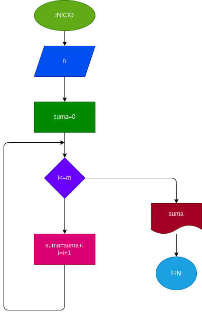

# interpretaciones-repetitivas
Programa para calcular la suma de los 10 primeros números naturales

Suma de los números naturales ingresados por el usuario.

# ANALISIS

Variables de entrada 

n : el numero seleccionado para operar la suma

Variables de proceso

Suma : el resultado final de la suma de numeros "n" 

i = la variable ingresa todos los numeros para ser sumados

Variables de salida suma : la suma realizada 

# DISEÑO

# CONSTRUCCION